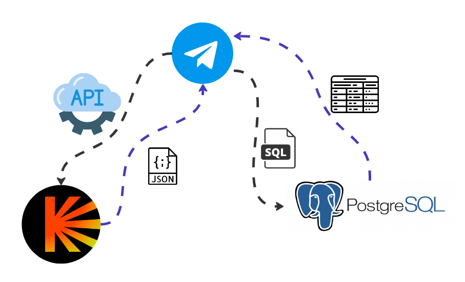

# MovieMatch

## 1. Введение

### 1.1 Цель проекта

**Цель**: создать telegram-бота, который поможет компании людей выбрать
фильм на вечер так, чтобы всех устроил

### 1.2 Целевая аудитория

1.  Любая компания, которая не всегда может найти фильм для просмотра
    всем вместе

2.  Человек, у которого закончились идеи о том, что бы посмотреть

### 1.3 Глоссарий

-   **Игра** - раунд проведения выбора фильма для компании

-   **Игрок** - пользователь, который в процессе игры

-   **Начальный игрок** - игрок, который начал игру

-   **Понравившийся фильм/сериал** - фильм/сериал, который пользователь
    в одной из игр отметил, как тот, который хочет посмотреть

-   **Фильтр** - установление начальным игроком жанра, годов выпуска

## 2. Общее описание продукта

### 2.1 Структура проекта

*Диаграма взаимодействия системы. На ней стрелочками показано
от кого к кому с каким типом данных присылается запрос или ответ, запрос
отмечается черной стрелочкой, ответ - синей*

1.  Бот отправляет API запрос к кинопоиску с фильтрами, чтобы тот достал
    фильмы/сериалы

2.  Кинопоиск возвращает ему json с результатами

3.  Бот предлагает пользователям полученные фильмы

4.  Для каждого игрока бот запоминает понравившиеся фильмы и кладет их в
    базу данных

5.  По запросу пользователя бот достает понравившиеся фильмы игрока

### 2.2 Классы и характеристики пользователей

Все пользователи относятся с одному классу - люди, которые не знают что
хотят посмотреть и для них проблематично запомнить какой фильм/сериал
когда-то заинтересовал.

### 2.3 Операционная среда

Для разработки телеграм бота используется PyCharm, Visual Studio Code на
языке Python.

### 2.4 Ограничения при проектировании

Языком разработки телеграм бота является язык программированися Python,
в качестве базы данных используется база данных PostgreSQL. Обмен
данными между ботом и кинопоиском происходит через API. Для обмена
данными между базой данных и телеграм ботом используется язык запросов
SQL.

### 2.5 Документация пользователя

-   Функция **/start** - начать общение с ботом, он присылает
    ознакомительное сообщение с описанием доступных команд.

-   Функция **/help** - получить список команд с описанием.

-   Функция **/startgame** - начать игру в текущем чате.

-   Функция **/getlist of liked** - олучить свой список понравившихся
    фильмов и сериалов.

## 3. Системные функции

### 3.1 Функция принятия данных от пользователя

Входными данными является текстовый запрос пользователя с помощью вызова
нужной функции из представленных в /help. В обработке пользовательского
запроса бот вызывает нужную функцию для ее обработки. Выходными данными
так же являются текстовые данные.

### 3.2 Функция обращения к кинопоиску

Входными данными являются 'фильтр' из запроса пользователя с помозью
которого и будет отправлятся запрос к кинопосику. Вызывает запрос GET с
нужными параметрами из \"фильтра\". Выходными данными является json.

### 3.3 Функция доставки данных в базу данных

Входными данными является id пользователя и информация о фильме, которую
надо положить в базу данных. Производится SQL запрос INSERT к базе
данных с values id и информацией о фильме.

### 3.4 Функция достать данные из базы данных

Входными данными является id пользователя, для которого надо достать
данные. Производится SQL запрос SELECT к базе данных с фильтром на id
пользователя. Выходными данными явзяется выборка из базы данных.

### 3.5 Функция обработки \"понравившихся фильмов\"

Входными данными является id фильма, а так же текущий фильм. Вызывается
функция доставки данных в базу данных.

## 4. Нефункциональные требования

### 4.1 Раширяемость

Проект должен поддерживать несколько обращений, например, проводить
несколько \"игр\" одновременно в разных чатах.

### 4.2 Интерфейс

Проект должен обладать понятным интерйфейсом, то есть наличие списка
команд с объяснением их смысла, а так же читабельное, удобное
представления информации о фильме во время \"игры\".

## 5 Тестирование

### 5.1 Тестирование раширяемости

Тестирование данного требования производится потем запуска нескольких
обращений от пользователей из разных чатов.

### 5.2 Тестирование корректного распознавания \"понравившихся фильмов\"

Тестирование данной функции производится путем проверки наличия в базе
даннх информации о фильме для нужного пользователя.
